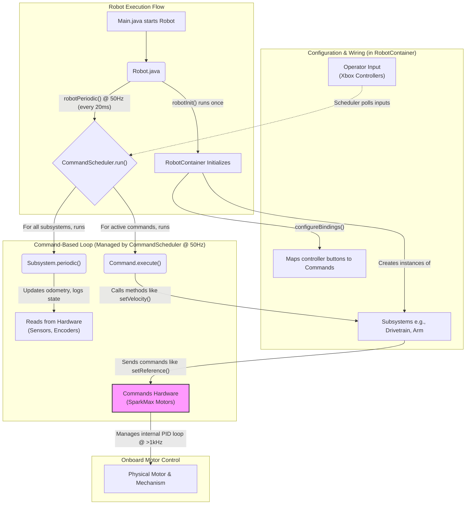

# Robot Code Architecture (2025 - Reefscape)

Welcome to the Team 7476 codebase! This document provides a high-level overview of our robot's software architecture. Its goal is to help new members understand how the code is organized, how the different components interact, and where to find key pieces of logic for tuning and development.

## Guiding Philosophy: Command-Based Programming

Our code is built on WPILib's **Command-Based programming model**. The core philosophy is **separation of concerns**. Instead of having all logic in one giant loop, we separate the code into three distinct categories:

-   **Subsystems**: Direct representations of the robot's hardware mechanisms (e.g., `Drivetrain`, `Arm`). They manage the hardware and expose simple methods like `setAngle()` or `runVelocity()`. A subsystem knows *what it can do*, but not *when to do it*.
-   **Commands**: The "live" logic that uses subsystems to perform an action (e.g., `AlignReefWithDrivePIDCmd`, `IndexToBeamBreakCmd`). A command knows *when* to do something and *what* it wants to accomplish, but not *how* the hardware works.
-   **Container**: The `RobotContainer` class acts as the central hub, "wiring" everything together. It initializes all subsystems and maps operator controls (joysticks, buttons) to specific commands.

## Game Context & Design Drivers

Reefscape rewards robots that **strip algae**, **launch it into the barge**, and stay nimble around a congested reef. Those physical objectives shape our software stack:

-   **Agile navigation**: Swerve with strong localization lets drivers dart between reef, processor, and staging zones without re-zeroing manually.
-   **Arm reach vs. extension limits**: Closed-loop arm positions guarantee we hit ground intake, reef removal, and processor angles while staying inside the 20-inch extension envelope.
-   **Reliable launch energy**: Closed-loop flywheels with selectable profiles keep algae shots clearing the barge even as motors warm up or batteries sag.
-   **Game-piece validation**: Beam breaks, color sensing, and optional ultrasonics confirm whether algae is actually staged before firing so we avoid empty shots or double-feeds.

## High-Level Control Flow

The entire robot operates on a 20ms "heartbeat" loop. The following diagram illustrates how an operator's button press translates into a physical action by the robot.


> **Key Takeaway:** The `CommandScheduler` is the heart of the robot. It runs the `periodic()` loops of every subsystem and the `execute()` loops of any active commands, ensuring all logic runs in a coordinated, non-blocking way.

---

## Systems Deep Dive

### 1. Drivetrain & Odometry

The Drivetrain is the most complex subsystem, responsible for movement and localization.

-   **Key Files**: `Drivetrain.java`, `MAXSwerveModule.java`
-   **Hardware**: 4x MAXSwerve Modules (each with 2 NEO motors), 1x NavX Gyro, and dual PhotonVision cameras mounted so one can see reef tags while the other watches the barge/source side.
-   **How it Works**:
    1.  The `Drivetrain`'s `periodic()` method is the core of its operation. In every 20ms loop, it reads the swerve module encoders and the gyro.
    2.  This data is fed into a `SwerveDrivePoseEstimator`, which calculates the robot's current position and heading on the field (its `Pose2d`). This process is called **odometry**.
    3.  Commands provide a high-level goal (e.g., `ChassisSpeeds`), which the `Drivetrain`'s kinematics helpers translate into specific target speeds and angles for each of the four modules. This keeps the robot centred in the calibrated barge launch zone without requiring tiny driver inputs.
    4.  Each `MAXSwerveModule` then uses its two onboard SPARK MAX PID controllers (one for drive velocity, one for turning position) to achieve its target state.

```java:Drivetrain.java
// In Drivetrain.java periodic() method
@Override
public void periodic() {
  // Get the current angle from the gyro sensor
  var gyroAngle = gyro.getRotation2d();
  
  // ... update pose estimator with gyro and module positions
  pose = odometry.update(gyroAngle, positions);

  // ... fuse vision data (see Vision section)
}
```

### 2. Autonomous (PathPlanner)

We use PathPlanner for creating and executing autonomous routines.

-   **Key Files**: `Drivetrain.java` (for configuration), `/src/main/deploy/pathplanner/` (for auto paths).
-   **How it Works**: PathPlanner acts like a "GPS" for the `Drivetrain`.
    1.  In the `Drivetrain` constructor, we configure the `AutoBuilder`, telling PathPlanner which methods to use to get the robot's pose and how to send it driving commands.
    2.  When an autonomous path is run, a `PPHolonomicDriveController` compares the robot's *actual* pose (from odometry) to the *desired* pose (from the pre-generated path) and calculates the necessary `ChassisSpeeds` to correct any error. Our autos lean on this to leave the starting zone, strip algae, and roll straight into a ready-to-launch pose before drivers take over.
    3.  These `ChassisSpeeds` are sent to the `Drivetrain`, which executes them.

```java:Drivetrain.java
// In Drivetrain.java constructor
AutoBuilder.configure(
    this::getPose, // 1. PathPlanner asks: "Where are we?"
    this::setOdometry,
    this::getChassisSpeedsRobotRelative,
    (speeds, feedforwards) -> runVelocityRobotRelative(speeds), // 2. PathPlanner commands: "Go this fast."
    new PPHolonomicDriveController(...), // 3. This is the "driver" that does the error correction.
    this);
```

### 3. Vision Systems

We use two separate vision systems for different tasks, both hosted on coprocessors so the roboRIO always has CPU headroom for drivetrain control.

#### A. PhotonVision for Pose Estimation

-   **Purpose**: To know where the robot is on the field (localization).
-   **Hardware**: Multiple cameras connected to a PhotonVision coprocessor (Orange Pi). Camera poses are stored in `Constants.Vision`, and the placements are chosen so at least one camera has AprilTags in view during reef work.
-   **How it Works**: This system detects the AprilTags on the field. The `PhotonPoseEstimator` calculates the robot's position based on these tags. This data is then "fused" with the odometry in the `Drivetrain.periodic()` loop to correct for drift from the wheels and gyro, ensuring our position estimate is highly accurate. We also log barge distance calculations so the driver knows if a requested shot is outside the calibrated window.

```java:Drivetrain.java
// In Drivetrain.java periodic() method
// This is where vision corrects our odometry
odometry.addVisionMeasurement(estimatedPose, visionPose.timestampSeconds);
```

#### B. OpenCV for "Algae" (Game Piece) Detection

-   **Purpose**: To find and track game pieces.
-   **Code Location**: `limelight/java/AlgaeDetection.java` and `limelight/python/`
-   **How it Works**: This is a classic OpenCV pipeline that runs on a Limelight or Orange Pi. It filters the camera feed for algae green (HSV thresholding), finds the largest resulting contour, and uses a calibrated camera matrix to approximate distance and heading. Scripts publish targets through NetworkTables so commands can auto-align the drivetrain or indexer. Venue lighting changes require reapplying the exposure/white balance presets captured in the engineering notebook.

### 4. Game Piece Handling: Intake, Indexer, & Launcher

This is the system of conveyors and wheels that acquires, stages, and scores the "algae."

-   **Key Files**: `IntakeSubsystem.java`, `Indexer.java`, `Launcher.java`, `IndexToBeamBreakCmd.java`.
-   **Intake**: Rollers on the arm that grab algae from the field. Controlled by simple "open-loop" percent output so the operator can feather speed when sliding up the reef or processor.
-   **Indexer**: An internal conveyor that moves algae from the intake to the launcher. It uses two **beam break sensors** (with an interchangeable ultrasonic implementation) to know when an algae piece is staged at entry and at the launcher throat. The `IndexToBeamBreakCmd` keeps the belts running just long enough to trip the sensors, preventing double-feeds and popped algae.
-   **Launcher**: Two independently controlled flywheels that spin up to speed using the SPARK MAX's onboard **velocity PID**. Commands toggle between "high" and "low" launch profiles tied to our barge calibration and allow fine-grained RPM offsets when game pieces or batteries behave differently than practice.

```java:RobotContainer.java
// This binding in RobotContainer shows the automation in action
// When the 'Y' button is pressed, the Indexer runs until the sensor is tripped
driverController.y().onTrue(new IndexToBeamBreakCmd(indexerSub, () -> 0.75));
```

### 5. Arm Subsystem

-   **Purpose**: To control the angle of the intake/arm mechanism.
-   **Key Files**: `ArmSubsystem.java`, `ArmSetPositionPIDCmd.java`.
-   **How it Works**: The arm uses the SPARK MAX's onboard **position PID** to move to and hold specific angles. A critical part of this is the **gravity feedforward** term (`kGainFF`), which helps the PID controller by proactively applying power to counteract the force of gravity. A REV Color Sensor V3 mounted near the rollers checks for algae presence and proximity, allowing commands to refuse launches when the arm is empty and giving the drive team confidence that a reef strip actually captured a game piece.

```java:ArmSubsystem.java
// In ArmSubsystem.java periodic() method
// This calculates the voltage needed just to hold the arm against gravity
double gravityCompensationFFVoltage = ArmConstants.kGainFF * Math.sin(getPosition());

// The controller is commanded to a position, with extra voltage to fight gravity
armClosedLoopController.setReference(
    setpoint,
    ControlType.kPosition,
    ClosedLoopSlot.kSlot0,
    gravityCompensationFFVoltage);
```

## Sensors & Coprocessors

-   **NavX Gyro**: Provides continuous heading for field-relative driving. If the gyro drops offline, the drivetrain automatically flips to robot-relative control so the driver still has predictable behavior.
-   **Beam Break / Ultrasonic Sensors**: Both implement the `IndexerSensor` interface, so we can swap between digital beam breaks and analog ultrasonics when mounting space or reflection issues arise.
-   **REV Color Sensor V3**: Detects algae color and proximity at the intake, backing up driver vision when the reef blocks sightlines.
-   **Limit/Homing Inputs**: The arm constructor accepts a limit switch channel and exposes `calibrate()` so pit crew can re-zero the encoder between matches.
-   **PhotonVision Coprocessor (Orange Pi)**: Runs the AprilTag pose pipeline for the dual cameras, publishing pose estimates and per-target metadata that the drivetrain consumes.
-   **Limelight / Orange Pi (Python)**: Hosts algae-detection scripts and the `vision-startup` batch workflow for redeploying code and Python dependencies.

## Data Logging & Driver Feedback

-   **AdvantageKit Logger** (`org.littletonrobotics.junction.Logger`) captures subsystem telemetry (velocities, sensor states, poses) so AdvantageScope replays can diagnose failures.
-   **SmartDashboard & Field2d** display barge distance warnings, shooter at-setpoint flags, and odometry comparisons in real time.
-   **LoggedDashboardChooser** wraps the autonomous selector so every match record includes which PathPlanner routine was requested.

---

## Configuration & Tuning

A key principle of our code is to keep tunable values out of the main logic. All tuning should be done in two central locations:

1.  **`Constants.java`**: This file is for **robot-wide numerical constants**.
    -   **What goes here**: CAN IDs, physical dimensions (wheelbase), gear ratios, control deadbands, and mechanism setpoints (e.g., `kAngleStowed`, `kVelocityHighFrontRPM`).
    -   **Think of it as**: *What* and *Where*.

2.  **`Configs.java`**: This file is for **hardware configuration bundles**, specifically for the SPARK MAX motor controllers.
    -   **What goes here**: PIDF gains (P, I, D, Feedforward), smart current limits, ramp rates, idle mode (brake/coast), and sensor conversion factors.
    -   **Think of it as**: *How* a motor should behave.

> **IMPORTANT**: The PID gains for the four identical swerve drive motors are shared. The same applies to the four swerve turning motors. However, every other mechanism (Arm, Launcher) has its own unique set of gains tuned for its specific job.

## How to Get Started (Onboarding for New Members)

1.  **Start with the Big Picture**: Read this document and understand the control flow diagram.
2.  **Explore `RobotContainer.java`**: This is the best place to see how everything is connected. Identify the subsystems and look at the `configureBindings()` method to see how the robot is controlled.
3.  **Pick One Subsystem**: Choose a subsystem (e.g., `ArmSubsystem`). Read its code to understand the methods it provides.
4.  **Check its Tuning**: Look in `Constants.java` and `Configs.java` to find the constants and PID gains associated with that subsystem.
5.  **Find its Commands**: Go back to `RobotContainer.java` and see which `Commands` are triggered by the operator controls to use that subsystem. Reading the `Command` file will show you the "live" logic.

By following these steps, you can quickly trace the logic from a button press all the way down to the hardware. Welcome to the team!
